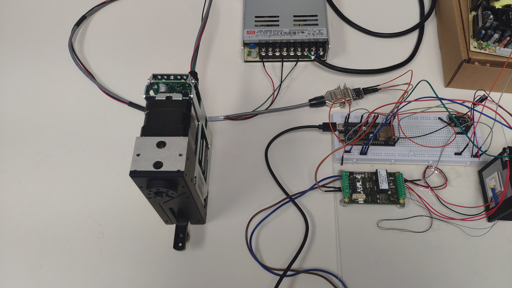

# C/C++ library with example to control syringe pump PSD4
 Inculding library and a simple application allow ESP32 Devkit1c to control syringe pump PSD4

 

 Including functions:

    // Function to initialize the PSD4 Pump
    PSD4_PUMP(byte Pump_Addr, byte COM_Port, int COM_Speed, byte RX_Pin, byte TX_Pin); 

    // Function to set operation mode of the Pump
    void PSD4_PUMP::Init_Pump(byte operation_mode); 

    // Function to set direction (Input/Output) of Port number (1 to 8) of the Valve 
    void PSD4_PUMP::Set_Port_Direction(byte Port_No, byte Port_Dir); 

    // Function to move syringe up/down No_of_Step steps from current position
    void PSD4_PUMP::Syringe_Move(byte Syringe_Dir, int No_of_Step);

    // Function to move syringe to an absolute position
    void PSD4_PUMP::Syringe_Move_To_Position(int Absolute_position);

    // Function to set parameters of motor
    void PSD4_PUMP::Set_Motor_Parameters(byte steps_sec_sec, int start_velo, int max_velo, byte speed_code, int stop_velo); 

    // Function to query current status of PSD4 pump
    void PSD4_PUMP::Get_Pump_Status();

    // Function to read the return data from the pump
    void PSD4_PUMP::Read_from_pump();

Notes:
   - Even this example is for ESP32 in particular, the library can be use with any other MCU that support C/C++.
   - Long delay() has been used here to make sure pump finish each command before sending the new ones. In a real application, function Get_Pump_Status() should be use to check if pump is ready for the new command.
   - Due to the difference in voltage of logic level between ESP32 (UART 3.3V TTL) and PSD4 (RS232 Standard), an RS232 to TTL converter need to be used to connect PSD4 pump communication cable with ESP32 UART port. Nulsom Ultra Compact RS232 to TTL converter was used here, but any other similar converter should work as well. 

   - https://www.amazon.com/Ultra-Compact-RS232-Converter-1Mbps/dp/B074BMLM11/ref=asc_df_B074BMLM11/?tag=hyprod-20&linkCode=df0&hvadid=692875362841&hvpos=&hvnetw=g&hvrand=7150092486955832903&hvpone=&hvptwo=&hvqmt=&hvdev=c&hvdvcmdl=&hvlocint=&hvlocphy=9011699&hvtargid=pla-2281435177338&psc=1&mcid=9191b20cb01934a380221ffdeaa7c628&hvocijid=7150092486955832903-B074BMLM11-&hvexpln=73
   
   - https://www.digikey.com/en/products/detail/artekit-labs/AK-RS232-M/20485391?utm_adgroup=&utm_source=google&utm_medium=cpc&utm_campaign=PMax_Product_Computer%20Equipment&utm_term=&utm_content=&utm_id=go_cmp-20471664459_adg-_ad-__dev-c_ext-_prd-20485391_sig-CjwKCAjw8rW2BhAgEiwAoRO5rBLKczJoOfdGyMBV1NfUqknI9sBZwSTKayq87pzUAliE3dIGeWttlRoCLVsQAvD_BwE&gad_source=1&gclid=CjwKCAjw8rW2BhAgEiwAoRO5rBLKczJoOfdGyMBV1NfUqknI9sBZwSTKayq87pzUAliE3dIGeWttlRoCLVsQAvD_BwE

Thank you!